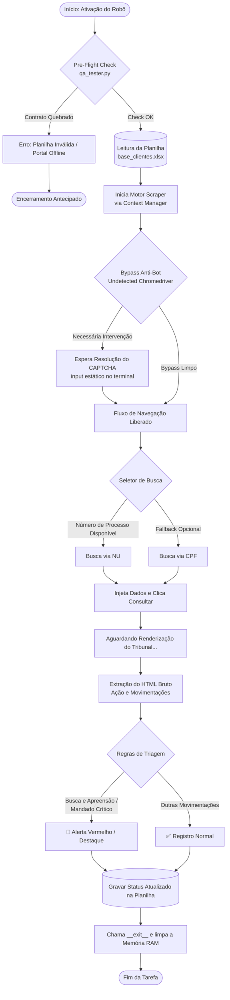
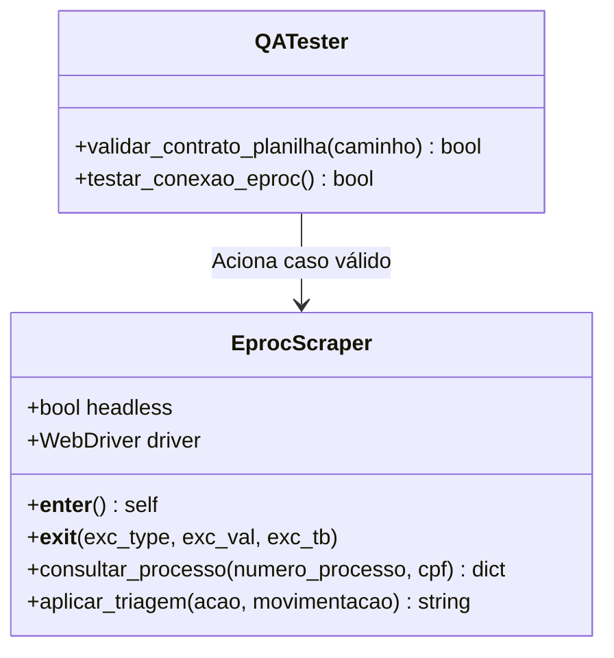

# 3. Fluxo de Automação do Eproc Tracker

Abaixo estão os diagramas estruturais e lógicos que mapeiam o ciclo de vida da execução da nossa aplicação, desde o pre-flight check de sanidade até a triagem dos resultados extraídos do tribunal.

> [!NOTE]
> Os diagramas servem como o mapa definitivo da aplicação. Qualquer nova feature de navegação deve ser encaixada logicamente neste fluxo antes da implementação.

## 🔄 Diagrama Geral das Etapas (Lifecycle)

Este fluxograma explica passo a passo a tomada de decisão do robô.

## 🏗️ Diagrama de Responsabilidades (UML de Classes)

O modelo Orientado a Objetos (OOP) separa a responsabilidade de testes da responsabilidade de navegação, mantendo o código altamente coeso e pouco acoplado.

---
> **🔗 Links Rápidos:** [[1. Setup Inicial|Setup Inicial]] | [[2. Arquitetura do Scraper|Arquitetura do Scraper]] | [[00 - Índice Eproc|🏠 Voltar ao Índice Geral]]
