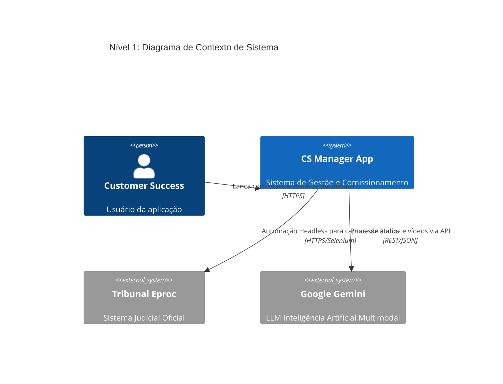
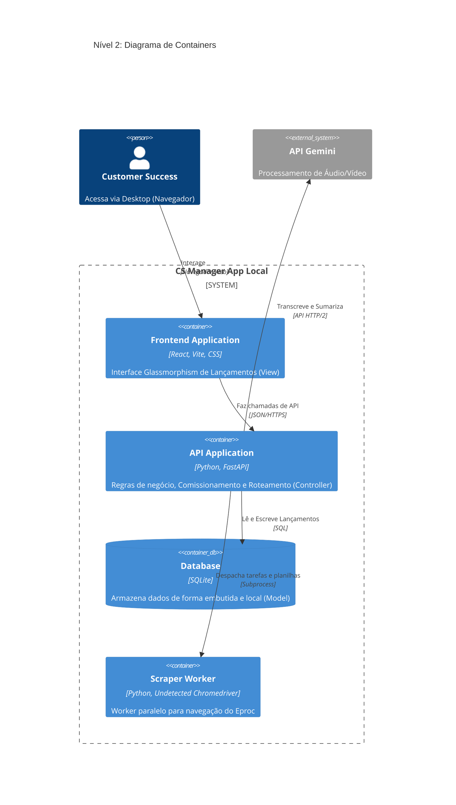

# 🏛️ C4 Model - Arquitetura do Sistema

O modelo C4 descreve a arquitetura em níveis de abstração, padronizando a comunicação técnica.

## Nível 1: Contexto de Sistema
Descreve as interações macro e integrações externas da aplicação.

## Nível 2: Container (MVC Expandido)
Mostra como o software é dividido internamente, detalhando os módulos.

---
> **🔗 Links Rápidos:** [[01. Documento de Requisitos (PRD)|Requisitos (PRD)]] | [[03. Diagramas de Sequencia|Fluxos de Sequência]] | [[00 - Índice Engenharia|🏠 Voltar ao Índice de Engenharia]]
