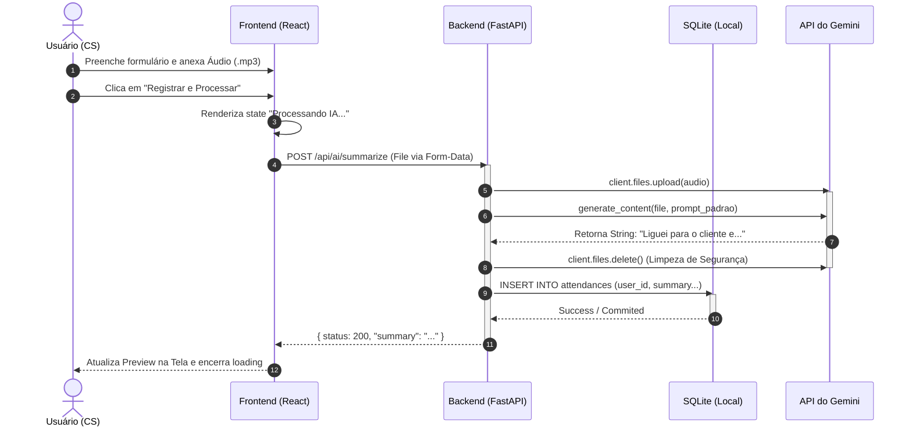

# ⏱️ Diagramas de Sequência

Demonstra o fluxo lógico ao longo do tempo para as ações principais, detalhando a comunicação entre os componentes.

## Fluxo 1: Processamento de Áudio por IA e Inserção no DB

---
> **🔗 Links Rápidos:** [[02. C4 Model - Arquitetura|Arquitetura (C4)]] | [[05. Documentacao da API (Swagger)|API (Swagger)]] | [[00 - Índice Engenharia|🏠 Voltar ao Índice de Engenharia]]
