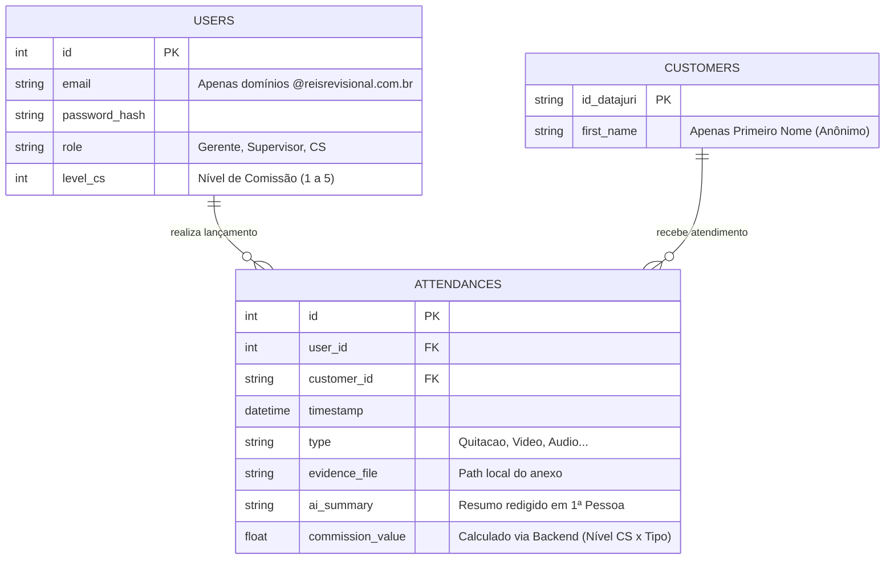

# 🗄️ Entidade-Relacionamento (ERD)

Este é o diagrama lógico relacional do nosso banco de dados embutido (SQLite). 

> [!NOTE]
> A segregação clara da tabela `CUSTOMERS` garante que IDs sensíveis ou CPFs não sejam processados indevidamente nos logs gerais de atendimentos.

---
> **🔗 Links Rápidos:** [[02. C4 Model - Arquitetura|Arquitetura (C4)]] | [[01. Documento de Requisitos (PRD)|Requisitos]] | [[00 - Índice Engenharia|🏠 Voltar ao Índice de Engenharia]]
